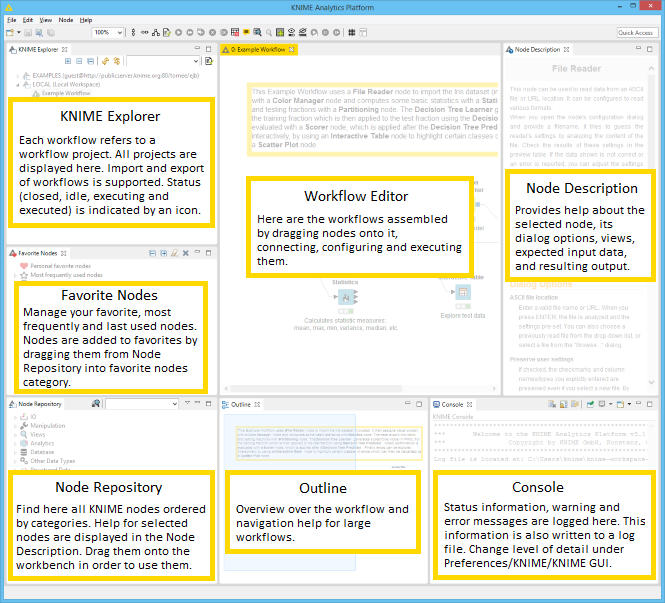

# Practise 1: Introducction to KNIME

* Download KNIME from https://www.knime.com/downloads and install
  * https://www.knime.com/installation
* Go to File>Install KNIME extensions and install
  * R integration
  * Weka integrattion
  * Textprocessing addon
  * CLustering addon
* Get used to its workbench

